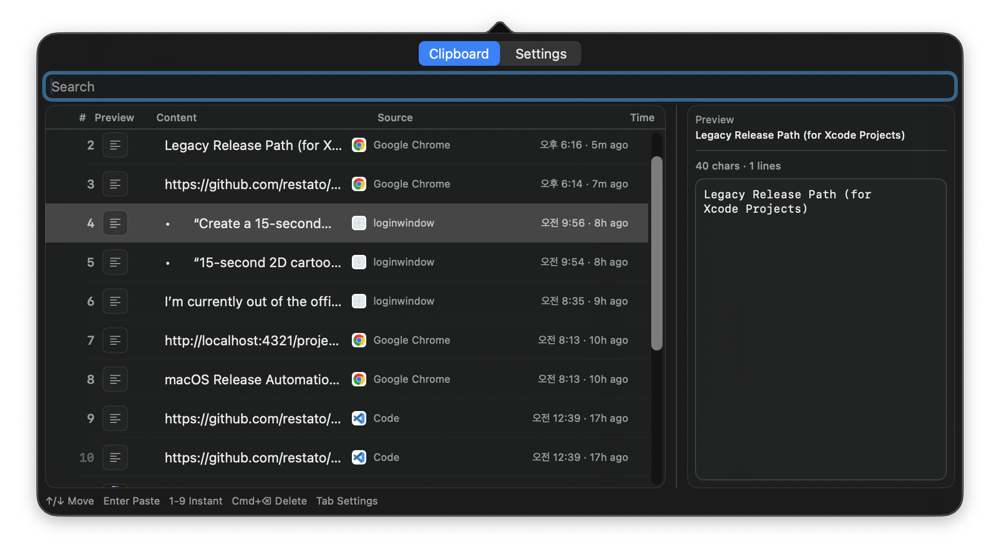

# macOS Clipboard Manager (Swift Package)

This repository includes the `ClipboardCore` domain logic and the menu bar demo app (`PasteDock`).  
The default release path is web distribution of a DMG signed and notarized with `Developer ID + Notary`, without using the App Store.

## Documentation

- Feature overview: `docs/features.md`
- Deployment operations guide: `docs/deployment.md`
- Product and architecture context: `docs/PRD.md`
- Phase 2 plan: `docs/phase2-plan.md`
- UI mockup: `docs/ascii-ui-preview.md`

## UI Screenshot

The screenshot below shows the `Clipboard` tab of PasteDock, including the searchable history list, source app/time columns, and the right-side preview panel.



## Quick Start

Run the app:

```bash
bash scripts/dev-run.sh --rebuild
```

Run tests:

```bash
swift test
```

Run directly:

```bash
swift run PasteDock
```

## Development Loop

```bash
bash scripts/dev-run.sh
bash scripts/dev-run.sh --rebuild
bash scripts/dev-tail-log.sh
bash scripts/dev-stop.sh
bash scripts/dev-diagnose-accessibility.sh
```

Utility scripts:

```bash
bash scripts/open-accessibility.sh
bash scripts/reveal-dev-app.sh
```

Runtime log:

```bash
~/Library/Application Support/com-justdoit-pastedock/logs/runtime.log
```

## App Icon

```bash
bash scripts/generate-app-icon.sh
```

- Source image: `assets/icon/source.png`
- Outputs:
  - `assets/icon/AppIcon.iconset/*`
  - `assets/icon/AppIcon.icns`
  - `assets/icon/menuBarTemplate.png`
- Automatically used by `dev-run.sh`, `package-demo-dmg.sh`, and `release-macos-spm.sh`

## Demo Build/Packaging

Demo binary:

```bash
bash scripts/build-demo-binary.sh release
```

Repeated binary builds:

```bash
bash scripts/repeat-build-demo.sh 3 release
```

Demo DMG (without notarization):

```bash
bash scripts/package-demo-dmg.sh release
```

## Production Release (Recommended: SPM Pipeline)

1) Copy and edit the environment template:

```bash
cp scripts/.env.release.example .env.release
```

2) Load environment variables:

```bash
set -a
source .env.release
set +a
```

3) Sign + notarize + staple + checksum:

```bash
bash scripts/release-macos-spm.sh release --tag "$RELEASE_TAG"
```

4) Create a GitHub Release and upload assets:

```bash
bash scripts/publish-github-release.sh --tag "$RELEASE_TAG"
```

Primary artifacts:

- `build/<AppName>-release/<run-id>-<config>/<AppName>-vX.Y.Z.dmg`
- `build/<AppName>-release/<run-id>-<config>/<AppName>-vX.Y.Z.dmg.sha256`
- `build/<AppName>-release/<run-id>-<config>/<AppName>.dmg` (fixed `latest` filename)
- `build/<AppName>-release/<run-id>-<config>/<AppName>.dmg.sha256` (fixed `latest` filename)
- `build/<AppName>-release/<run-id>-<config>/metadata.txt`

For a stable latest-download entry point on your landing page:

- `https://restato.github.io/projects/pastedock/`

## Accessibility Troubleshooting Summary

- If the app does not appear in the permission list, open the real bundle location with `bash scripts/reveal-dev-app.sh` and add it manually.
- If Accessibility permission keeps resetting, verify signing status with `bash scripts/dev-diagnose-accessibility.sh`.
- If `Restored only (permission needed)` repeats, re-enable Accessibility permission and run `Re-check`.
