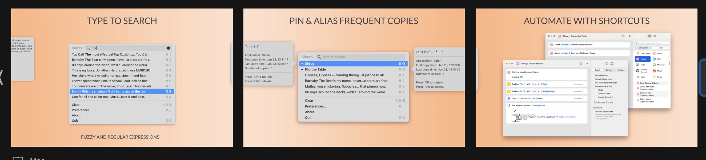

# v1.2 ASCII UI Preview

## 1) Menu Bar Anchor Panel Layout

```text
Menu Bar
┌───────────────────────────────────────────────────────────────────────────────┐
│  ...   [PasteDock]                                                           │
└───────────────────────────────────────────────────────────────────────────────┘
                       ▼ anchor (active menu bar item)

╭───────────────────────────────────────────────────────────────────────────────╮
│ Search: [ safari invoice ]                                            [Esc]  │
│───────────────────────────────────────────────────────────────────────────────│
│ #  Preview   Content                             Source          Time          │
│ 1  [🖼]      Quarterly report summary             Safari          11:32 · 2m    │
│ 2  [🖼]      [Image] 824 KB                       Figma           11:31 · 3m    │
│ 3  [📄]      ~~invoice.pdf~~                      Finder          11:30 · 4m    │
│              missing source file                                              │
│ 4  [📦]      [Files 3] deck.key +2               Mail            11:29 · 5m    │
│ 5  [≡]      API token rotation note              Unknown app     11:28 · 6m    │
│───────────────────────────────────────────────────────────────────────────────│
│ ↑/↓ Move   Enter Paste   1~9 Quick Select   Multi-digit: 12 + Enter          │
╰───────────────────────────────────────────────────────────────────────────────╯
```

- Left lane: index / thumbnail / body text
- Right lane: `Source` and `Time` are separated columns
- Panel is positioned below menu bar anchor, then clamped to screen bounds

## 2) State Variants

### Text entry

```text
  7   [≡]  Build pipeline green after fix     Xcode     14:02 · 3m
```

### Image entry

```text
  8   [🖼]  [Image] 1,024 KB               Preview   14:01 · 4m
```

### Single file entry

```text
  9   [📄]  [File] report-final.pdf        Finder    14:00 · 5m
```

### Multi-file entry

```text
 10   [📦]  [Files 4] report-final.pdf +3   Finder   13:59 · 6m
```

### Unknown source

```text
 11   [≡]  copied content            Unknown app   13:58 · 7m
```

### Restore failure (missing source file)

```text
[Toast] Restore failed (file missing)
(History entry remains, user can retry or remove manually)

Row hint:
  ~~report-final.pdf~~
  missing source file
```

## 3) Keyboard Flow

```text
Input loop:
  ↑ / ↓         -> selection moves
  Enter         -> execute selected item (or top item if none)
  1~9           -> immediate single-digit select
  10+           -> buffered multi-digit index (e.g. 1 then 2)
  Enter         -> commit buffered index
  Esc           -> close panel
```

```text
Multi-digit example:
  Keys: 1, 2, Enter
  Buffer: "1" -> "12"
  Action: select row #12 and execute
```
